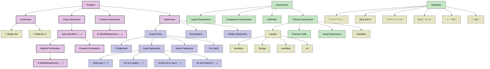

```mermaid
graph TD
    classDef structure fill:#e6c5e6,stroke:#333,stroke-width:2px,color:black
    classDef statement fill:#c5c5e6,stroke:#333,stroke-width:1px,color:black
    classDef expression fill:#c5e6c5,stroke:#333,stroke-width:1px,color:black
    classDef primitive fill:#e6e6c5,stroke:#333,stroke-width:1px,color:black

    %% Main program structure
    Program["Program"]:::structure --> ClassDecl["Class Declaration"]:::structure
    Program --> FuncDecl["Function Declaration"]:::structure
    Program --> Comments["Comments"]:::structure
    Program --> Statements["Statements"]:::structure
    
    %% Comments section
    Comments --> SLC["// Single line"]:::primitive
    Comments --> MLC["/* Multi line */"]:::primitive
    
    %% Class structure
    ClassDecl --> ClassBody["class Identifier { ... }"]:::structure
    ClassBody --> Methods["Method Declaration"]:::structure
    ClassBody --> Props["Property Declaration"]:::structure
    Methods --> MethodDef["fn identifier(params) { ... }"]:::structure
    
    %% Function structure
    FuncDecl --> FunctionDef["fn identifier(params) { ... }"]:::structure
    
    %% Statements section
    Statements --> ControlFlow["Control Flow"]:::statement
    Statements --> DeclarationStmt["Declarations"]:::statement
    Statements --> SimpleStmt["Simple Statements"]:::statement

    %% Control flow statements
    ControlFlow --> IfStmt["If Statement"]:::statement
    ControlFlow --> LoopStmt["Loop Statements"]:::statement
    ControlFlow --> SwitchStmt["Switch Statement"]:::statement
    ControlFlow --> TryCatchStmt["Try-Catch"]:::statement

    %% Loop types
    LoopStmt --> While["while expr { ... }"]:::statement
    LoopStmt --> For["for id in range { ... }"]:::statement
    LoopStmt --> ForEach["foreach id in expr { ... }"]:::statement
    LoopStmt --> TraditionalFor["for init;cond;iter { ... }"]:::statement
    
    %% Expression types
    ExprTypes["Expressions"]:::expression --> LogicalExpr["Logical Expressions"]:::expression
    ExprTypes --> ComparisonExpr["Comparison Expressions"]:::expression
    ExprTypes --> ArithmeticExpr["Arithmetic"]:::expression
    ExprTypes --> PrimaryExpr["Primary Expressions"]:::expression

    %% Primary expressions
    PrimaryExpr --> Literals["Literals"]:::primitive
    PrimaryExpr --> FunctionCall["Function Calls"]:::expression
    PrimaryExpr --> ArrayExpr["Array Expressions"]:::expression
    PrimaryExpr --> Variables["Variables"]:::primitive

    %% Literals
    Literals --> Numbers["Numbers"]:::primitive
    Literals --> Strings["Strings"]:::primitive
    Literals --> Booleans["true/false"]:::primitive
    Literals --> NilVal["nil"]:::primitive

    %% Operators grouped by precedence
    Operators["Operators"]:::expression --> Assignment["= += -= *= /= ..."]:::primitive
    Operators --> LogicalOp["&& || and or"]:::primitive
    Operators --> ComparisonOp["== != < > <= >="]:::primitive
    Operators --> BitwiseOp["& | # ~ << >>"]:::primitive
    Operators --> ArithmeticOp["+ - * / % ^"]:::primitive
    Operators --> UnaryOp["! - not ~"]:::primitive
```