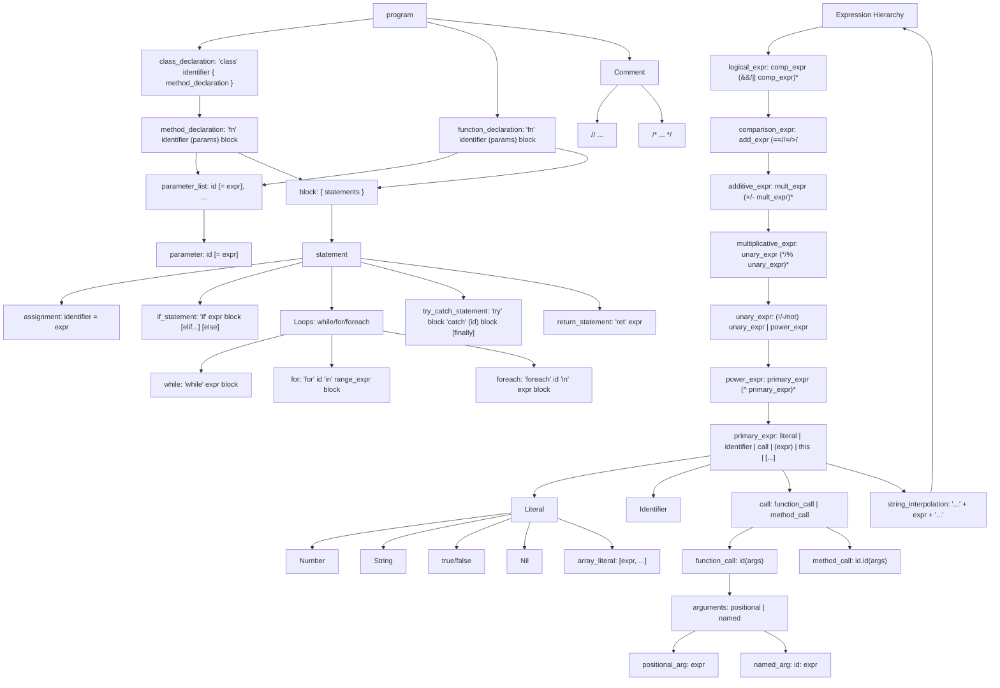

```mermaid
graph TD
    %% Programme et structure globale
    Program["program"] --> ClassDeclaration
    Program --> FunctionDeclaration
    Program --> Comment

    %% Commentaires
    Comment --> SingleLineComment["// ..."]
    Comment --> MultiLineComment["/* ... */"]

    %% Classes
    ClassDeclaration["class_declaration: 'class' identifier { method_declaration }"] --> MethodDeclaration
    MethodDeclaration["method_declaration: 'fn' identifier (params) block"] --> ParameterList
    MethodDeclaration --> Block

    %% Fonctions
    FunctionDeclaration["function_declaration: 'fn' identifier (params) block"] --> ParameterList
    FunctionDeclaration --> Block

    %% Blocs et instructions
    Block["block: { statements }"] --> Statement
    Statement["statement"] --> Assignment["assignment: identifier = expr"]
    Statement --> IfStatement["if_statement: 'if' expr block [elif...] [else]"]
    Statement --> Loop["Loops: while/for/foreach"]
    Statement --> TryCatch["try_catch_statement: 'try' block 'catch' (id) block [finally]"]
    Statement --> Return["return_statement: 'ret' expr"]

    %% Boucles
    Loop --> While["while: 'while' expr block"]
    Loop --> For["for: 'for' id 'in' range_expr block"]
    Loop --> Foreach["foreach: 'foreach' id 'in' expr block"]

    %% Expressions
    ExprHierarchy["Expression Hierarchy"] --> LogicalExpr["logical_expr: comp_expr (&&/|| comp_expr)*"]
    LogicalExpr --> ComparisonExpr["comparison_expr: add_expr (==/!=/>/</... add_expr)*"]
    ComparisonExpr --> AdditiveExpr["additive_expr: mult_expr (+/- mult_expr)*"]
    AdditiveExpr --> MultiplicativeExpr["multiplicative_expr: unary_expr (*/% unary_expr)*"]
    MultiplicativeExpr --> UnaryExpr["unary_expr: (!/-/not) unary_expr | power_expr"]
    UnaryExpr --> PowerExpr["power_expr: primary_expr (^ primary_expr)*"]
    PowerExpr --> PrimaryExpr["primary_expr: literal | identifier | call | (expr) | this | [...]"]

    %% Éléments primaires
    PrimaryExpr --> Literal
    PrimaryExpr --> Identifier
    PrimaryExpr --> Call["call: function_call | method_call"]
    PrimaryExpr --> StringInterpolation["string_interpolation: '...' + expr + '...'"]

    %% Littéraux
    Literal --> Number
    Literal --> String
    Literal --> Boolean["true/false"]
    Literal --> Nil
    Literal --> Array["array_literal: [expr, ...]"]

    %% Appels
    Call --> FunctionCall["function_call: id(args)"]
    Call --> MethodCall["method_call: id.id(args)"]
    FunctionCall --> Args["arguments: positional | named"]
    Args --> Positional["positional_arg: expr"]
    Args --> Named["named_arg: id: expr"]

    %% Autres
    ParameterList["parameter_list: id [= expr], ..."] --> Parameter["parameter: id [= expr]"]
    StringInterpolation --> ExprHierarchy
```